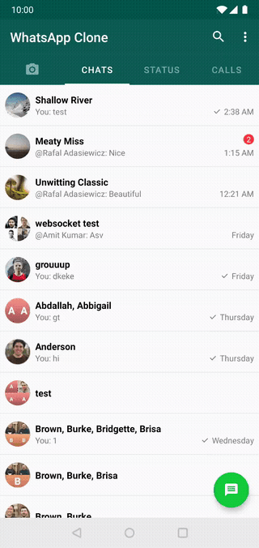
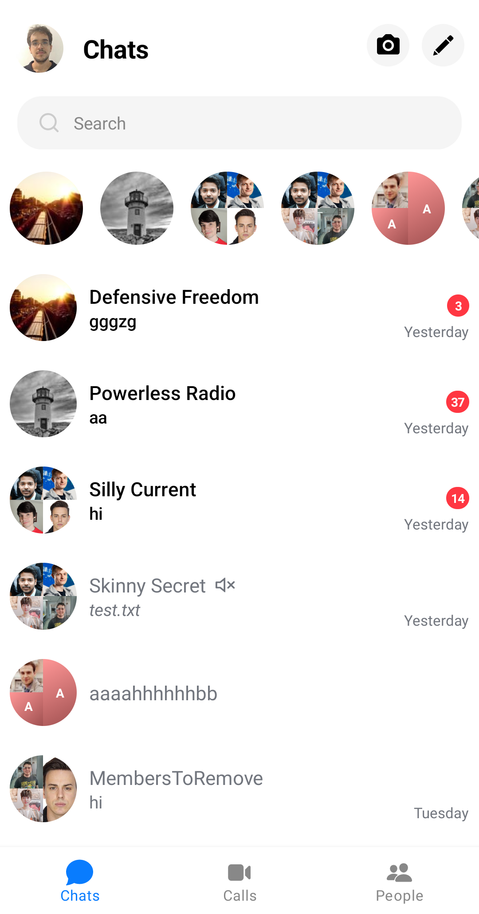

<h1 align="center">Android Sample Apps</h1>

<p align="center">
  <a href="https://github.com/GetStream/stream-video-android/actions/workflows/android.yml"></a>
  <a href="https://android-arsenal.com/api?level=21"></a>
  <a href="https://getstream.io"></a>
</p>

<p align="center">
  <a href="https://github.com/GetStream/stream-chat-android">
    
  </a>
</p>

## 😎 Repo Overview

This repository contains sample projects, guides, tutorials, and links to helpful resources to help you get started with [Android Stream SDK](https://github.com/GetStream/stream-chat-android).

<a href="https://getstream.io/chat/sdk/compose?utm_source=Github&utm_medium=Jaewoong_OSS&utm_content=Developer&utm_campaign=Github_Mar2024_Jaewoong_Android_Samples&utm_term=DevRelOss">

</a>

## 🔗 Quick Links

- [Register For a Free Account](https://getstream.io/try-for-free/?utm_source=Github&utm_medium=Jaewoong_OSS&utm_content=Developer&utm_campaign=Github_Mar2024_Jaewoong_Android_Samples&utm_term=DevRelOss)
- [Android Chat SDK Repository](https://github.com/GetStream/stream-chat-android)

**Tutorials:**

- [Android Chat Tutorial](https://getstream.io/tutorials/android-chat/)
- [Compose Chat Tutorial](https://getstream.io/chat/compose/tutorial/)

**Documentation:**

- [Client Documentation](https://getstream.io/chat/docs/android/?language=kotlin/?utm_source=Github&utm_medium=Jaewoong_OSS&utm_content=Developer&utm_campaign=Github_Mar2024_Jaewoong_Android_Samples&utm_term=DevRelOss)
- [UI Components Documentation](https://getstream.io/chat/docs/sdk/android/ui/overview/?utm_source=Github&utm_medium=Jaewoong_OSS&utm_content=Developer&utm_campaign=Github_Mar2024_Jaewoong_Android_Samples&utm_term=DevRelOss)
- [Compose UI Components Documentation](https://getstream.io/chat/docs/sdk/android/compose/overview/?utm_source=Github&utm_medium=Jaewoong_OSS&utm_content=Developer&utm_campaign=Github_Mar2024_Jaewoong_Android_Samples&utm_term=DevRelOss)
- [API docs](https://getstream.github.io/stream-chat-android/?utm_source=Github&utm_medium=Jaewoong_OSS&utm_content=Developer&utm_campaign=Github_Mar2024_Jaewoong_Android_Samples&utm_term=DevRelOss)

## 📹 Stream Video SDK

Stream also offers seamless Video SDK solutions that allow you to implement video calling, audio/video room, and live streaming using Jetpack Compose. If you're interested in learning the Stream Video SDKs, check out the tutorials below:

- [Stream Video SDK for Android on GitHub](https://github.com/getstream/stream-video-android)
- [Video Call Tutorial](https://getstream.io/video/docs/android/tutorials/video-calling?utm_source=Github&utm_medium=Jaewoong_OSS&utm_content=Developer&utm_campaign=Github_Mar2024_Jaewoong_Android_Samples/&utm_term=DevRelOss)
- [Audio Room Tutorial](https://getstream.io/video/docs/android/tutorials/audio-room/?utm_source=Github&utm_medium=Jaewoong_OSS&utm_content=Developer&utm_campaign=Github_Mar2024_Jaewoong_Android_Samples&utm_term=DevRelOss)
- [Livestream Tutorial](https://getstream.io/video/docs/android/tutorials/livestream/?utm_source=Github&utm_medium=Jaewoong_OSS&utm_content=Developer&utm_campaign=Github_Mar2024_Jaewoong_Android_Samples&utm_term=DevRelOss)

## 🤝 Contribution

Submissions are always welcomed! You can create your own open-source project or sample app by creating a new module for this project following our **[Android Chat Tutorial](https://getstream.io/tutorials/android-chat/)** or **[Compose Chat Tutorial](https://getstream.io/chat/compose/tutorial/)**.
After building your project, create an issue or pull request. Your project will be categorized 😎 under our featuring list after reviewing the project in our team.

We also welcome code changes that improve the apps or fix a problem. Please follow all best practices and add tests if applicable before submitting a Pull Request on Github.

## 🚀 Main Samples

| Project | |
|:-----|---------|
|  <br><h3>UI Components Sample App</h3> <br>The main sample app built on top of our [UI components](https://github.com/GetStream/stream-chat-android/tree/main/stream-chat-android-ui-components). Maintained to support the latest version of the SDK. <br><br>• Multiple users accounts<br>• Offline support<br>• Message search and filtering<br>• Channel creation<br>• Push notifications<br>• Threads and replies<br>• Emoji reactions<br>• User mentions<br>• Giphy integration<br>• Attachments picker<br>• Typing indicators<br><br> **[> Source Code](https://github.com/GetStream/stream-chat-android/tree/main/stream-chat-android-ui-components-sample)**<br><br> |  |
|  |  |
|  <br><h3>Compose UI Components Sample App</h3> <br>The main sample app built on top of our [Compose UI Components](https://github.com/GetStream/stream-chat-android/tree/main/stream-chat-android-compose). Maintained to support the latest version of the SDK. <br><br>• Multiple users accounts<br>• Offline support<br>• Channel search and filtering<br>• Push notifications<br>• Threads and replies<br>• Emoji reactions<br>• User mentions<br>• Giphy integration<br>• Attachments picker<br>• Typing indicators<br><br> **[> Source Code](https://github.com/GetStream/stream-chat-android/tree/main/stream-chat-android-compose-sample)** <br><br> |  |
|  |  |

## ✈️ Additional samples

| Project | |
|:-----|---------|
|  <br><h3>Video Chat Sample</h3> <br>Livestream app that demonstrates how to use the low level client to listen for events. <br><br>• Video list and details<br>• Custom message list<br>• Low level client integration<br><br>**[> Source Code](video-chat-sample)**<br><br> |  |
|  |  |
|  <br><h3>Virtual Event Sample</h3> <br>Virtual event sample app. <br><br>• Direct and livestream chats<br>• Light and dark modes<br>• Multiple user accounts<br><br>**[> Source Code](virtual-event-sample)** <br><br> |  |
|  |  |
|  <br><h3>WhatsApp Clone</h3> <br>WhatsApp clone app. <br><br>• Custom message input<br>• Custom message list header<br><br>**[> Source Code](whatsapp-clone-sample)** <br><br> |  |
|  |  |
|  <br><h3>WhatsApp Clone Compose</h3> <br>WhatsApp clone app built with Jetpack Compose and Stream Chat SDK for Compose. <br><br>• Implementing entire UI elements with Jetpack Compose<br>• Implementation of Android architecture components with Jetpack libraries such as Hilt and AppStartup<br>• Performing background tasks with Kotlin Coroutines<br>• Integrating chat systems with Stream Chat SDK for real-time event handling<br><br> **[> Source Code](https://github.com/GetStream/whatsApp-clone-compose)**<br><br> |  |
|  |  |
|  <br><h3>Slack Clone Compose</h3> <br>Slack clone app built with Jetpack Compose and Stream Chat SDK for Compose following clean architecture principles.<br><br>• Implementing entire UI elements with Jetpack Compose<br>• Implementation of Android architecture components with Jetpack libraries such as Hilt<br>• Performing background tasks with Kotlin Coroutines<br>• Integrating chat systems with Stream Chat SDK for real-time event handling and authentication<br><br>**[> Source Code](https://github.com/GetStream/stream-slack-clone-android)** <br><br> |  |
|  |  |
|  <br><h3>Avengers Chat</h3> <br>Demo application based on modern Android tech stacks and Stream Chat SDK. <br><br>• Light and Dark themes<br>• Different color themes by a chosen character<br>• 100% offline mode supports<br>• Live stream chat example<br>• Channel and message lists<br>• Direct message and group messages<br>• Mentioned message list<br>• Custom emoji reactions<br>• Guest mode<br>• User online/offline status<br>• User last active date<br>• User info & direct message dialogs<br>• Visual animations like transition<br><br>**[> Source Code](https://github.com/GetStream/AvengersChat)** <br><br> |  |
|  |  |
|  <br><h3>Facebook Messenger Clone</h3> <br>Facebook Messenger clone using Stream SDK & Jetpack Compose. <br><br>**[> Source Code](https://github.com/MathRoda/Messenger-clone)** <br><br> |  |
|  |  |
|  <br><h3>Stream Draw</h3> <br>Real-time multiplayer drawing & chat game app built entirely with Jetpack Compose. <br><br>• Light and Dark themes<br>• Creating and joining a group channel<br>• Supports host mode and guest mode<br>• Welcome and exit messages<br>• Fetches a list of words from the network<br>• Real-time drawing on the sketchbook<br>• Real-time chat messaging with multiple users<br>• Real-time participants' list of a connected channel<br>• Guessing a word and congratulation animations<br>• Single message notification and real-time chat dialog for the host<br>• Restarting game by the host<br>• Exiting and deleting the channel by the host<br>• And a lot of additional features using Stream Chat SDK for Android!<br><br>**[> Source Code](https://github.com/GetStream/stream-draw-android)** <br><br> |  |
|  |  |
|  <br><h3>Foldable Chat</h3> <br>Demonstrates adaptive and responsive UIs with Jetpack WindowManager API. <br><br>**[> Source Code](https://github.com/GetStream/foldable-chat-android)** <br><br> |  |
|  |  |

## Chat Guides
See [here](https://getstream.io/chat/docs/sdk/android/) for all our chat guides.

These guides explore our UI components in greater detail and demonstrate how to easily perform a variety of common actions using the Stream Chat Android SDK, such as:

- [Adding Push Notifications](https://getstream.io/chat/docs/sdk/android/client/guides/push-notifications)
- [Sending Custom Attachments](https://getstream.io/chat/docs/sdk/android/client/guides/sending-custom-attachments)
- [Handling Channel List Updates](https://getstream.io/chat/docs/sdk/android/client/guides/channel-list-updates)
- [Providing Offline Support](https://getstream.io/chat/docs/sdk/android/client/guides/offline-support)

**UI Components:**

- [Building a Channel List Screen](https://getstream.io/chat/docs/sdk/android/ui/guides/building-channel-list-screen)
- [Building a Message List Screen](https://getstream.io/chat/docs/sdk/android/ui/guides/building-message-list-screen)
- [Creating a Custom Message Input View](https://getstream.io/chat/docs/sdk/android/ui/guides/custom-message-input/)
- [Adding Localization](https://getstream.io/chat/docs/sdk/android/ui/guides/custom-translations)
- [App Startup Initializers](https://getstream.io/chat/docs/sdk/android/ui/guides/app-startup-initializers)
- [Implementing Own Capabilities](https://getstream.io/chat/docs/sdk/android/ui/guides/implementing-own-capabilities) 
- [Providing Custom Reactions](https://getstream.io/chat/docs/sdk/android/ui/guides/providing-custom-reactions) 
- [Adding Custom Attachments (MessageInputView)](https://getstream.io/chat/docs/sdk/android/ui/guides/adding-custom-attachments-message-input)
- [Adding Custom Attachments (MessageComposerView)](https://getstream.io/chat/docs/sdk/android/ui/guides/adding-custom-attachments-message-composer) 

**Compose UI Components:**

- [Adding Custom Attachments](https://getstream.io/chat/docs/sdk/android/compose/guides/adding-custom-attachments)
- [Implementing Own Capabilities](https://getstream.io/chat/docs/sdk/android/compose/guides/implementing-own-capabilities)
- [Providing Custom Reactions](https://getstream.io/chat/docs/sdk/android/compose/guides/providing-custom-reactions)

## What is Stream?

Stream allows developers to rapidly deploy scalable feeds and chat messaging with an industry leading 99.999% uptime SLA guarantee.

With Stream's chat components, developers quickly add chat to their app for a variety of use-cases:

- Livestreams like Twitch or Youtube
- In-Game chat like Overwatch or Fortnite
- Team style chat like Slack
- Messaging style chat like Whatsapp or Facebook's messenger
- Commerce chat like Drift or Intercom

## 💼 We are hiring

We've recently closed a [\$38 million Series B funding round](https://techcrunch.com/2021/03/04/stream-raises-38m-as-its-chat-and-activity-feed-apis-power-communications-for-1b-users/) and we keep actively growing.
Our APIs are used by more than a billion end-users, and you'll have a chance to make a huge impact on the product within a team of the strongest engineers all over the world.

Check out our current openings and apply via [Stream's website](https://getstream.io/team/#jobs).    

## License

```
The MIT License (MIT)

Copyright (c) 2014-2022 Stream.io Inc. All rights reserved.

Permission is hereby granted, free of charge, to any person obtaining a copy
of this software and associated documentation files (the "Software"), to deal
in the Software without restriction, including without limitation the rights
to use, copy, modify, merge, publish, distribute, sublicense, and/or sell
copies of the Software, and to permit persons to whom the Software is
furnished to do so, subject to the following conditions:

The above copyright notice and this permission notice shall be included in
all copies or substantial portions of the Software.

THE SOFTWARE IS PROVIDED "AS IS", WITHOUT WARRANTY OF ANY KIND, EXPRESS OR
IMPLIED, INCLUDING BUT NOT LIMITED TO THE WARRANTIES OF MERCHANTABILITY,
FITNESS FOR A PARTICULAR PURPOSE AND NONINFRINGEMENT. IN NO EVENT SHALL THE
AUTHORS OR COPYRIGHT HOLDERS BE LIABLE FOR ANY CLAIM, DAMAGES OR OTHER
LIABILITY, WHETHER IN AN ACTION OF CONTRACT, TORT OR OTHERWISE, ARISING FROM,
OUT OF OR IN CONNECTION WITH THE SOFTWARE OR THE USE OR OTHER DEALINGS IN
THE SOFTWARE.
```