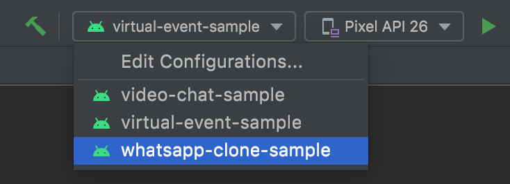

# WhatsApp Chat Clone


## Running the sample

To run this sample app, start by cloning this repo:

```shell
git clone https://github.com/GetStream/Android-Samples.git
```

Next, open [Android Studio](https://developer.android.com/studio) and open the newly cloned project folder. Make sure you run the app in this module (`whatsapp-clone-sample`).

